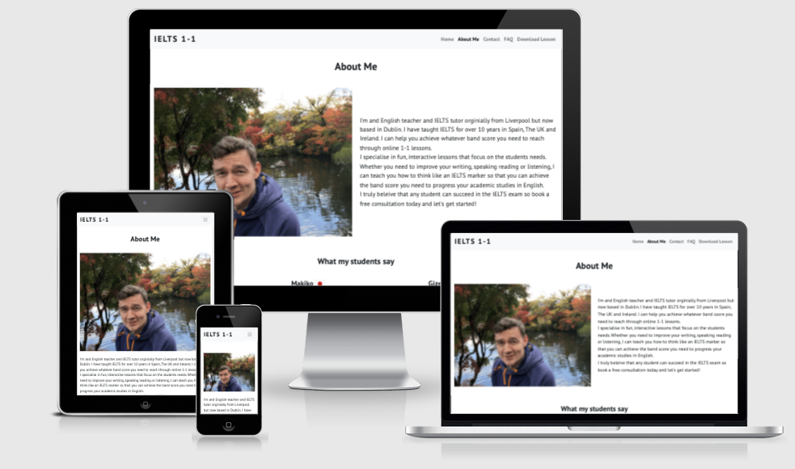
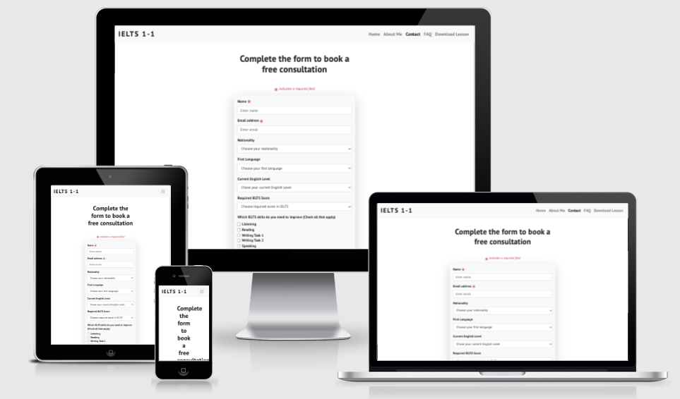

# **IELTS 1-1 Website**


## **Project Goals**

The primary goal of this site is to provide information to prospective students and to encourage them to enquire about one-to-one online tuition for the IETLS English Language exam . 

## **UX**

### *User goals*

The central audience for this site is English as a foreign language(EFL) students over the age of 18 who are planning to take the IELTS exam to enter university in and English-speaking country. 

### **Site user goals**

To find key information about IELTS tuition including:

*   Pricing of lessons
*   Structure and timing of lessons
*   How a tutor could help them achieve their academic goals
*   How soon they can achieve their goals
*   Information about the experience and teaching style of the tutor

This site will meet these goals because

*   Pricing information will be clearly presented at the top of an ‘FAQ’ page
*   Options regarding structure and timing of lessons will be clearly and simply presented in the ‘FAQ’ page.
*   A contact form will allow students to highlight their specific needs and goals, and directly tell the tutor what they want to achieve and when they need to achieve it
*   An ‘About Me’ page will provide the student with information about the tutor’s experience and provide testimonials from ex-students. 
*   A free PDF lesson will be available to download to give the student an example of the teaching methods and style of the tutor.

## **Wireframes**

[Wireframes](assets/wireframes.pdf)

### **User Story**
    
As a student who is considering 1-to-1 IELTS online tuition, I want:

1. Information presented in a clear and easy to understand English.
2. Information about the tutor’s experience with the IELTS exam.
3. Examples of the tutor’s teaching materials.
4. Information about the tutor’s method and style of teaching.
5. The ability to find the exact cost of lessons.
6. The ability to communicate to the tutor my exact goals and what I need to improve.

**Design Choices**

The overall design of the site was based on clarity and simplicity. As this is a site aimed at English as a foreign language (EFL) students, information is presented as clearly as possible without any distracting backgrounds and simple clear colour schemes.
The following design choices were made with this in mind:

* **Font**

Only one font is used throughout the site and that is Open Sans, which was chosen for its readability in headings and smaller texts.

* **Colours**

The colour palette of the site revolves around the dark blue background of the hero-image. Uploading the hero-image to a colour gradient generator allowed for the footer background colour to match stylistically so that the colour is represented on every page. 
```
background: linear-gradient(105deg, rgba(50, 116, 166, 1) 0%, rgba(2, 34, 59, 1) 100%)
```

Any text that laid over the background colour was given the colour of 'Aliceblue' to contrast it. The download button on the homepage was given a red colour to stand out against the blue background while matching the red diagonal stripe that goes through the hero image. 

## **Features**

### **Existing Features**

**Elements on every page** 

* **Navbar**
    * The navigation bar has the name IELTS 1-1 in the top-left corner and when clicked will bring you to the homepage.
    * In the top-right corner are the five list-items 
        * Home
        * About me
        * Contact
        * FAQ
        * Download Lesson - Which downloads a PDF lesson file
    * The navbar is collapsed into a burger icon on small screens.
    * The navbar stay at the top of the screen at all times when scrolling to allow for easy navigation from any page to another.     

* **Footer**    
    * The footer always appears below each page's content and has a background  gradient colour similar to the hero-image background colour to maintain a consistent colour theme throughout the site.
    * IELTS 1-1 brand name appears in the centre and can be clicked to be taken to the homepage.
    * Copyright information is found below the brand name.     


**Homepage**


**Hero Image**

* The hero image shows four wooden blocks spelling out IELTS on a blue background with a red diagonal stripe going through. This image was chosen for its bright colour and simplicity. 
* Overlaying the image are two taglines "Learn IELTS Online" and "Improve your band score online" in the colour 'Aliceblue' with a slight shadow to stand out against the blue background. On larger screens this text is left aligned and on mobile screens it is centred, with the second tag-line appearing below the centre of the hero-image. 
* Below the text is a red download button when clicked will download a copy of a PDF lesson.

**Cards**

* Below the hero image are three cards giving more information about the purpose of the site. 
* The first card gives more information about the tutor and contains an 'About' button link which will take the user to the about me page.     
* The second card gives more information about the type of lessons offered and contains a 'Contact' button link which will take the user to the contact page.  
* The third card gives more information about the services offered and contains a 'Learn More' button link which will take the user to the FAQ page. 
* On mobile these columns appear vertically. 


**About Me Page**



**Profile Image**

* A profile image of myself wearing a blue top in front of a lake in Japan, chosen for its bright colours and the continuation of the blue colour theme, aligned to the left on the large screens and centre aligned on tablets and mobile devices.

**Profile Text**

* A short about me profile text giving information about my teaching history and style. 

**Student Testimonials**

* Three student testimonials from ex-students, with a flag next to name representing their nationality, on mobile screens these three columns are arranged vertically. 
 

**Contact Page**


**Contact Form**

* A contact form allowing students to enter information about themselves and their academic goals.
    * Name (A required field)
    * Email Address (A required field)
    * Nationality drop down box 
    * First language drop down box
    * Current English Level drop down box
    * Required IELTS score drop down box
    * An IELTS skills check box field containing the 5 major exam parts of the IELTS exam. 
    * A text area in which students can give more information. The reason which this is a required field is it gives the site owner an opportunity to see the prospective students writing ability. 

  

 **FAQ Page**
 
 
 **Accordion**
    * The accordion is open at the first question and answer upon the page loading.
    * Each question and answer can be open or closed by clicking on the question text of the plus/minus sign on the right hand side. 
    * The question text is in blue to maintain the colour theme of the site. 
    * Below the accordion is a contact email address for sute-users to use if they have any other additional questions.


**Potential Future Features**

* An embedded Example video lesson and video testimonials from students.  
* An expanded download section 

## **Technologies Used**

### **Languages Used**
* [HTML5](https://html.com/html5/)
* [CSS3](https://www.w3.org/Style/CSS/Overview.en.html)

## **Frameworks, Libraries & Programs Used**
* [Bootstrap 4](https://getbootstrap.com/)
    * Imported CSS and JS, utilised grid system, navbar, form control and accordion components.

* [Google Fonts](https://fonts.google.com/)
    * Google fonts were used to import the 'PT Sans' font into the style.css file which is used on all pages throughout the project.

* [Git](https://git-scm.com/)
    * Git was used for version control by utilizing the Gitpod terminal to commit to Git and Push to GitHub.

* [Github](https://github.com/)
    * GitHub is used to store the projects code after being pushed from Git.

* [Balsamiq](https://balsamiq.com/)
    * Balsamiq was used to create the wireframes during the design process.

* [Flag-Icon-CSS](https://github.com/lipis/flag-icon-css)
    * This library was used to import Flag icons next to student's testimonials.

## **Testing**

Testing information can be found in this [separate testing file](testing.md). 

## **Deployment**

This site was developed using Gitpod and committed and pushed to Github through the built in terminal in Gitpod. 

To deploy this page to GitHub Pages the following steps should be taken.
1. Log in to **Github**
2. Selecte the Milestone-Project-1 repository
3. Click on **Settings**
4. Select the **Pages** tab on the left sidebar.
5. In the **Source** settings click on the dropwdown menu that is currently displaying *None*.
6. In the **Select Branch** settings change from *None* to *Master*.
7. Click on **Save** and the link to the deployed page will appear automatically in a green box with a tick stating "Your site is published". 

To run this site locally the following steps should be taken. 

**Run in Gitpod**

1. Download [Gitpod extension](https://www.gitpod.io/docs/browser-extension/) in chrome 
2. Log into Gitpod
3. Go to the Github projects and select the [milestone-project-1 repository](https://github.com/jameskelly33/milestone-project-1).
4. There should be a green **Gitpod** button on the top right next to  the **Code** button
5. Click the green **Gitpod** button
6. A Gitpod workspace will load allowing the user to work locally.

**Run in an alternate IDE**

1. Go to GitHub projects  and select the [milestone-project-1 repository](https://github.com/jameskelly33/milestone-project-1).
2. Above the list of files click the **Code** button. 
3. In the Clone with HTTPs section, copy the clone URL for the repository.
4. In your local IDE open the terminal.
5. Change the current working directory to the desired location.
6. Type ```git clone```, and then paste the URL you copied in Step 3.
7. Press Enter. Your local clone will be created.


## **Credits**

### Code

[Bootstrap 4](https://getbootstrap.com/)  grid system a was used to make the site responsive and the class library was used for card deck, contact form and faq accordion components and general styling. 

The dropdown list of nationalities in the contact form came from this [github gist post](https://gist.github.com/didats/8154290)

The dropdown list of languages in the contact form came from this [stack overflow post](https://stackoverflow.com/questions/38909766/list-of-all-country-languages-for-dropdown-select-menu-html-form)

The background linear-gradient colour of the footer was created by uploading the hero image to this [CSS Gradient Generator] (https://cssgradient.io/)

The flag icons for the student testimonials were imported from this [library] (https://github.com/lipis/flag-icon-css)

The Plus/ Minus icons on for the Bootstrap FAQ accordion was adapted from this [codepen] (https://codepen.io/kamelagandhi/pen/WjOpVY)

The sticky footer code was adapted from this [youtube video](https://www.youtube.com/watch?v=qlCIXXhSX6Y&t=385s&ab_channel=DaniKrossing)


### **Content**

All of the site content was written by the developer- with the exception of the student testimonials - see acknowledgements below. 
The PDF download file was authored by the developer. 

### **Media**

The hero image was licensed from [Adobe Stock Images](https://stock.adobe.com/ie/images/ielts-international-standardised-test-of-english-language/320133606?prev_url=detail). 

The profile image is the developer's own. 

### **Acknowledgements**

My CodeInsitute mentor, Antonija Simic, for her thorough and constructive feedback.

My former students Mikhail, Makiko, and Gizem for their generous testimonials. 

My friends and family for helping testing the site.

Tutor support at Codeinstitue for their invaluable support and clear guidance. 


